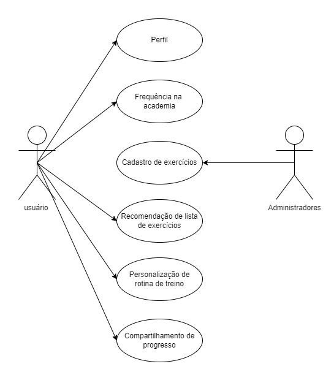

# Especificações do Projeto

Através de pesquisas de campo dentro do público alvo do projeto, foram estipuladas as personas que seguem juntamente de suas histórias de usuário, dando origem aos requisitos funcionais e não funcionais da aplicação.

## Personas

### Nayara de Carvalho

Formada em Arquitetura, trabalha como projetista em uma construtora que atende todo o território nacional.

| MOTIVAÇÕES                                                                                                                                                                                                                      | FRUSTRAÇÕES                                                                                                                                                                                                                                                                                                                                                                                                                                | HOBBIES / HISTÓRIA                                                                                                                                                                                                                                         |
| ------------------------------------------------------------------------------------------------------------------------------------------------------------------------------------------------------------------------------- | ------------------------------------------------------------------------------------------------------------------------------------------------------------------------------------------------------------------------------------------------------------------------------------------------------------------------------------------------------------------------------------------------------------------------------------------ | ---------------------------------------------------------------------------------------------------------------------------------------------------------------------------------------------------------------------------------------------------------- |
| Nayara é adepta a um estilo de vida saudável, tenta manter sempre que possível uma dieta equilibrada e a prática regular de exercícios físicos. Sua maior motivação é manter a saúde em dia para envelhecer com mais qualidade. | Ela não tem condições para contratar um personal qualificado para acompanhamento no treino, e se frusta com os serviços disponibilizados pelos instrutores das academias. Seu trabalho como arquiteta exige muito de seu tempo, sendo necessário diversas horas extras e finais de semana, o acarreta falta de tempo para buscar em meios tradicionais de pesquisa como Google e Youtube treinos que sejam relevantes para seus objetivos. | Nayara não busca pelo fisiculturismo ou cultura body building, a prática de exercícios físicos é uma forma de prazer e descontração, seu maior objetivo é ficar em forma e saudável principalmente a longo prazo.Ela tem facilidade de uso com tecnologia. |

---

### Rafael Mendes

Formado em Administração, trabalha em um escritório de gestão comercial.

| MOTIVAÇÕES                                                                                                                                                                                                                     | FRUSTRAÇÕES                                                                                                                      | HOBBIES / HISTÓRIA                                                                                                                                                              |
| ------------------------------------------------------------------------------------------------------------------------------------------------------------------------------------------------------------------------------ | -------------------------------------------------------------------------------------------------------------------------------- | ------------------------------------------------------------------------------------------------------------------------------------------------------------------------------- |
| Rafael treina desde muito jovem e sempre teve a academia como um ambiente de renovação e descontração. Antes de cursar Administração seu desejo era Ed. Física, mas por oportunidade de emprego acabou seguindo em outra área. | Não gosta de ser acompanhado durantes os treinos (personal) e sente que os instrutores de academia sempre sugerem mais do mesmo. | Rafael é curioso e apaixonado pela Ed. Física, gosta de se aventurar e experimentar diferentes combinações de treinos, seja por pesquisas ou indicações de colegas da academia. |

---

### Márcio Pereira

Formado em Engenharia Civil, trabalha em uma construtora local.

| MOTIVAÇÕES                                                                                                                      | FRUSTRAÇÕES                                                                                                                                                                                                                                                                                                                                                                            | HOBBIES / HISTÓRIA                                                                                                                                                                                                                                                                                                                                                             |
| ------------------------------------------------------------------------------------------------------------------------------- | -------------------------------------------------------------------------------------------------------------------------------------------------------------------------------------------------------------------------------------------------------------------------------------------------------------------------------------------------------------------------------------- | ------------------------------------------------------------------------------------------------------------------------------------------------------------------------------------------------------------------------------------------------------------------------------------------------------------------------------------------------------------------------------ |
| Márcio nunca foi adepto a academia ou estilo de vida fitness, mas por recomendação médica se motivou a buscar estas atividades. | Não se adaptou bem com a presença do personal trainer durante os treinos e não sente que os instrutores da academia adaptem seu treino às suas necessidades. Indiferente da idade, os treinos são sempre semelhantes. Ao pesquisar treinos na internet, ele percebeu que a maioria são voltados para pessoas jovens, sendo treinos de alta intensidade, o que vai contra seus desejos. | Márcio sempre teve grande contato com a tecnologia, e apesar de ser Engenheiro Civil sempre considerou a ideia de seguir em T.I. Ele tem grande facilidade para utilizar tecnologias e se adaptar a novos aplicativos.Seu maior desejo para ingressar na academia é não depender de ninguém para saber seu treino e ter acesso a vídeos que ilustrem como o exercício é feito. |

---

### Rubens Almeida

Atua como Advogado em um escritório de região central.

| MOTIVAÇÕES                                                                                                                                                     | FRUSTRAÇÕES                                                                                                                                                                                                                                                                                                                                   | HOBBIES / HISTÓRIA                                                                                                                                                                                                                                                                                                                                                             |
| -------------------------------------------------------------------------------------------------------------------------------------------------------------- | --------------------------------------------------------------------------------------------------------------------------------------------------------------------------------------------------------------------------------------------------------------------------------------------------------------------------------------------- | ------------------------------------------------------------------------------------------------------------------------------------------------------------------------------------------------------------------------------------------------------------------------------------------------------------------------------------------------------------------------------ |
| Após exames médicos, Rubens constatou sobrepeso e hipertensão, o que o motivou a buscar a prática de exercícios físicos alinhados a uma dieta mais balanceada. | Rubens não gosta de frequentar academia, nunca foi algo do seu estilo de vida, mas a condição médica não o deu outra opção. Ele se sente mal na presença de alguém o acompanhando nos treinos, como um personal trainer, e gostaria de não depender dos instrutores das academias, gostaria de ter a liberdade e autonomia para se exercitar. | Ele atua como advogado em um escritório da família, sua rotina de trabalho é bastante sedentária, em que vai e volta de carro do trabalho e geralmente passa o dia sentado. Com o passar dos anos, juntamente de uma dieta desequilibrada, Rubens adquiriu sobrepeso e algumas condições médicas. Essa situação serviu de alerta para realizar mudanças no seu estilo de vida. |

---

## Histórias de Usuários

A partir da compreensão do dia a dia das personas identificadas para o projeto, foram registradas as seguintes histórias de usuários.

| EU COMO... `PERSONA` | QUERO/PRECISO ... `FUNCIONALIDADE`                                                                                          | PARA ... `MOTIVO/VALOR`                                                                                                                                                                                                                                                                                             |
| -------------------- | --------------------------------------------------------------------------------------------------------------------------- | ------------------------------------------------------------------------------------------------------------------------------------------------------------------------------------------------------------------------------------------------------------------------------------------------------------------- |
| Nayara de Carvalho   | Preciso de treinos de qualidade adaptados aos meus objetivos.                                                               | Não executar exercícios desnecessários ou que vão contra os objetivos.                                                                                                                                                                                                                                              |
| Nayara de Carvalho   | Não precisar gastar ou ter um custo baixo para confecção de treinos para academia.                                          | Não tenho condições de pagar personal trainer e não gosto dos serviços fornecidos pelos instrutores de academia.                                                                                                                                                                                                    |
| Nayara de Carvalho   | Poder encontrar um treino ideal de forma rápida, visual e intuitiva.                                                        | Não tenho conhecimentos em educação física e nem tempo suficiente para pesquisar sobre.                                                                                                                                                                                                                             |
| Rafael Mendes        | Mais opções de combinações de treinos para diferentes tipos de objetivos.                                                   | Me aventurar nos diferentes resultados possíveis na academia mediante ajustes no treino.                                                                                                                                                                                                                            |
| Rafael Mendes        | Poder verificar em seu celular o treino durante a sua execução, com indicação da ordem e a cadência correta dos exercícios. | Ter maior praticidade, coesão e evitar distrações na academia.                                                                                                                                                                                                                                                      |
| Márcio Pereira       | Treinos adaptados para minha idade.                                                                                         | A maioria dos treinos encontrados em pesquisas na internet são voltados para pessoas mais jovens.                                                                                                                                                                                                                   |
| Márcio Pereira       | Acesso a vídeos que ilustrem como cada exercício é feito na ordem do treino.                                                | Muitos exercícios têm nomes pouco intuitivos e que muitas vezes são chamados com mais de um nome, o que causa confusão na hora de buscar como é feito. Ter um link direto ao exercício indicado para um vídeo resolveria essa confusão. Também não depender de ajuda na academia para saber como fazer um exercício |
| Márcio Pereira       | Poder acessar offline o plano do treino.                                                                                    | O wifi na academia nem sempre funciona e o sinal móvel é ruim lá.                                                                                                                                                                                                                                                   |
| Felipe de Melo       | Escolher treinos de maior intensidade.                                                                                      | Intensificar o ganho muscular na academia.                                                                                                                                                                                                                                                                          |
| Felipe de Melo       | Compartilhar meus novos treinos.                                                                                            | Intensificar a experiência na academia junto dos meus amigos                                                                                                                                                                                                                                                        |
| Rubens Almeida       | Escolher treinos focados em perda de gordura corporal e aumento do condicionamento físico.                                  | Intensificar os treinos rumo aos objetivos desejados.                                                                                                                                                                                                                                                               |
| Rubens Almeida       | Ter controle da minha frequência na academia                                                                                | Evitar a procrastinação e me incentivar a cumprir metas                                                                                                                                                                                                                                                             |

## Requisitos

As tabelas que se seguem apresentam os requisitos funcionais e não funcionais que detalham o escopo do projeto. Para determinar a prioridade de requisitos, aplicar uma técnica de priorização de requisitos e detalhar como a técnica foi aplicada.

### Requisitos Funcionais

| ID     | Descrição do Requisito                  | Prioridade |
| ------ | --------------------------------------- | ---------- |
| RF-001 | Permitir que o usuário cadastre tarefas | ALTA       |
| RF-002 | Emitir um relatório de tarefas no mês   | MÉDIA      |

### Requisitos não Funcionais

| ID      | Descrição do Requisito                                            | Prioridade |
| ------- | ----------------------------------------------------------------- | ---------- |
| RNF-001 | O sistema deve ser responsivo para rodar em um dispositivos móvel | MÉDIA      |
| RNF-002 | Deve processar requisições do usuário em no máximo 3s             | BAIXA      |

Com base nas Histórias de Usuário, enumere os requisitos da sua solução. Classifique esses requisitos em dois grupos:

- [Requisitos Funcionais
  (RF)](https://pt.wikipedia.org/wiki/Requisito_funcional):
  correspondem a uma funcionalidade que deve estar presente na
  plataforma (ex: cadastro de usuário).
- [Requisitos Não Funcionais
  (RNF)](https://pt.wikipedia.org/wiki/Requisito_n%C3%A3o_funcional):
  correspondem a uma característica técnica, seja de usabilidade,
  desempenho, confiabilidade, segurança ou outro (ex: suporte a
  dispositivos iOS e Android).
  Lembre-se que cada requisito deve corresponder à uma e somente uma
  característica alvo da sua solução. Além disso, certifique-se de que
  todos os aspectos capturados nas Histórias de Usuário foram cobertos.

## Restrições

O projeto está restrito pelos itens apresentados na tabela a seguir.

| ID  | Restrição                                             |
| --- | ----------------------------------------------------- |
| 01  | O projeto deverá ser entregue até o final do semestre |
| 02  | Não pode ser desenvolvido um módulo de backend        |

Enumere as restrições à sua solução. Lembre-se de que as restrições geralmente limitam a solução candidata.

> **Links Úteis**:
>
> - [O que são Requisitos Funcionais e Requisitos Não Funcionais?](https://codificar.com.br/requisitos-funcionais-nao-funcionais/)
> - [O que são requisitos funcionais e requisitos não funcionais?](https://analisederequisitos.com.br/requisitos-funcionais-e-requisitos-nao-funcionais-o-que-sao/)

## Diagrama de Casos de Uso

