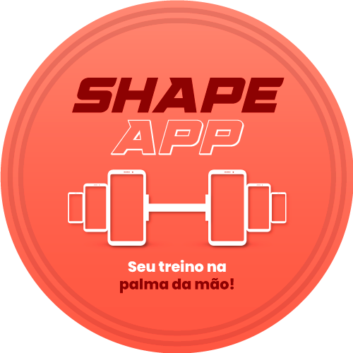
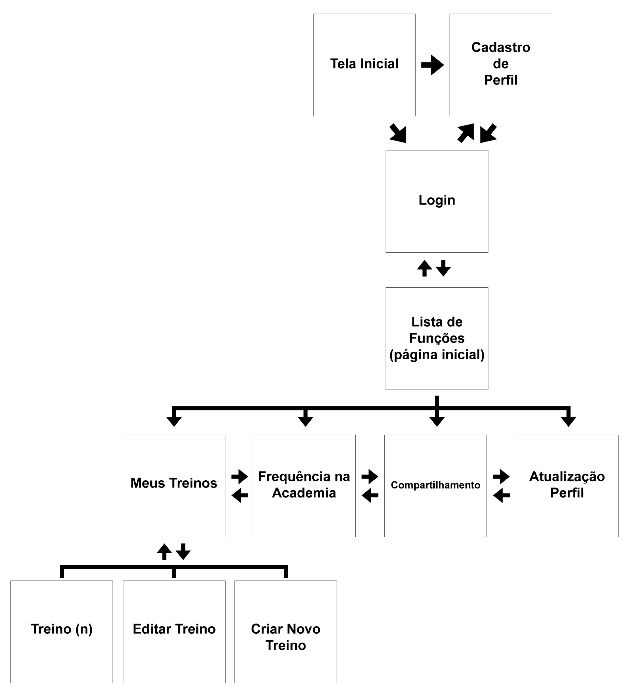

# Projeto de Interface

A marca Shape App, que nomeia o aplicativo em discussão, foi desenvolvida pensando em atributos de design que remetam as soluções que ele se propõe a realizar, descritas nas <a href="02-Especificação do Projeto.md"> Especificações do Projeto.</a>.

 
O uso de fontes quadradas san-serif no logo, traz imponência e remete a ideia de energia e agressividade, fazendo alusão a prática de exercícios físicos.
 
 

As cores escolhidas corroboram com essas sensações, a cromoterapia das cores quentes remete a energia, vitalidade, disposição, animação e muitas outras sensações relacionadas a prática de esportes em geral.

A fonte de sistema escolhida foi a família Poppins. Esta família tipográfica sans-serif se baseia em formas geométricas de alta legibilidade, que trazem um ar mais jovem e descolado para a aplicação, além de ser uma família de fontes padrão da web, disponível no Google Fonts, o que a torna amplamente compatível com a maioria dos dispositivos.

## Diagrama de Fluxo

O diagrama de fluxos de telas abaixo representa o fluxo básico de telas nas quais o usuário pode navegar a fim de solucionar os requisitos funcionais descritos em <a href="02-Especificação do Projeto.md">Especificações do Projeto.</a>

## Wireframes

Cada uma das telas acima foi prototipada em wireframes que são apresentados a seguir.

Os protótipos seguem o conceito de Mobile First, por esse motivo inicialmente foram desenvolvidos com foco em dispositivos mobile, em que na etapa de desenvolvimento da interface definitiva, o layout desktop basicamente fará a adaptação dos elementos para as telas com maior largura.

#### Tela Inicial

#### Cadastro de Perfil

#### Login

#### Pagina Incial

#### Meus Treinos

#### Edição do treino

#### Novo Treino

#### Frequencia na Academia

#### Compartilhamento

#### Atualização de Perfil

