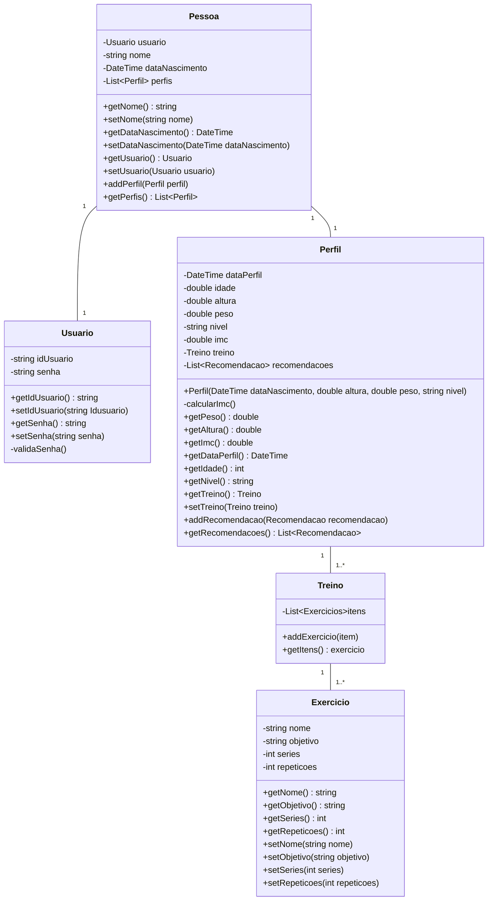
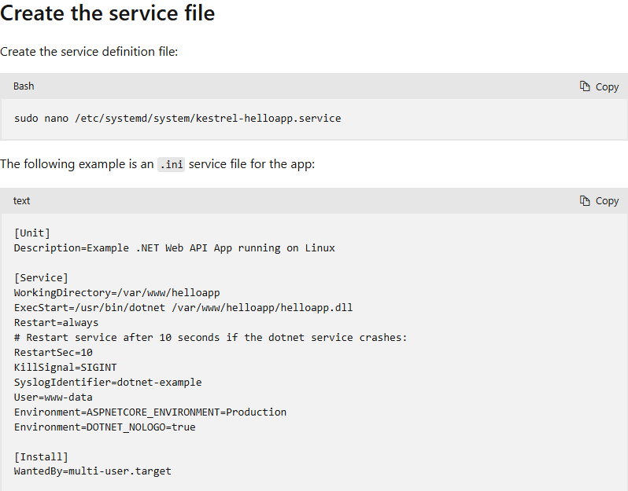

# Arquitetura da Solução

Pré-requisitos: <a href="3-Projeto de Interface.md"> Projeto de Interface</a>

Definição de como o software é estruturado em termos dos componentes que fazem parte da solução e do ambiente de hospedagem da aplicação.

## Diagrama de Classes

Para utilizar o sistema um usuário precisa de credenciais que serão gerenciadas pelo **Usuário**. Após fazer o login, ele irá completar o cadastro com seu nome e senha, essas informações irão compor a classe **PESSOA**. Para acessar a lista de exercícios, o usuário deverá preencher o seu **PERFIL** com peso, altura e idade, dessa forma o app irá fazer a recomendação de uma lista de **EXERCÍCIOS** que ele poderá personalizar e obter o **TREINO**.

---

## Arquitetura de Solução

A arquitetura de microserviços foi considerada a mais adequada para este projeto pelo fato de que permite uma maior escalabilidade, flexibilidade e modularidade. Com a arquitetura de microserviços, cada componente do sistema pode ser desenvolvido, implantado e escalado independentemente, o que facilita a manutenção e evolução do aplicativo. Além disso, os microsserviços podem ser projetados para se concentrar em áreas específicas de funcionalidade, como autenticação de usuários, recomendação de exercícios e gerenciamento de treinamentos, o que facilita a organização e a manutenção do código. Isso também permite que diferentes equipes trabalhem em paralelo em partes diferentes do aplicativo, acelerando o desenvolvimento e permitindo uma resposta mais rápida às mudanças e demandas do mercado.

Assim, neste primeiro momento, a proposta de arquitetura engloba:

1 - Frontend do Aplicativo: Esta é a interface com o usuário, onde eles interagem com o aplicativo. Pode ser desenvolvido usando tecnologias web como ReactJS, AngularJS, ou frameworks de aplicativos móveis como React Native ou Flutter.

2 - Backend de Autenticação e Gerenciamento de Usuários: Este microsserviço gerencia a autenticação dos usuários e mantém os dados relacionados às contas dos usuários, como informações pessoais, histórico de treinamento. Ainda não se tem definição do protocolo de implementação (python, node e etc...)

3 - Serviço de Perfis de Usuários: Este serviço é responsável por armazenar e gerenciar os perfis dos usuários, incluindo informações como sexo, idade, altura, peso e objetivos de condicionamento físico. O grupo não definiu se este será um serviço integrado ou separado.

4 - Serviço de Recomendação de Exercícios: Este microsserviço é responsável por recomendar exercícios com base nos perfis dos usuários e em seus objetivos de condicionamento físico. Este serviço será baseado em filtragem colaborativa ou sistemas baseados em regras.

5 - Serviço de Gerenciamento de Treinos: Este serviço é responsável por criar e gerenciar os treinos dos usuários com base nas recomendações de exercícios. Ele pode acompanhar o progresso do usuário e ajustar os treinos conforme necessário. (opcional, visto a dificuldade técnica de realização do trabalho);

6 - Serviço de Notificação e Lembrete: Este serviço envia notificações e lembretes aos usuários para incentivar a consistência em sua rotina de exercícios. Pode ser configurado para enviar lembretes de treino, dicas de saúde, etc. (opcional, visto a dificuldade técnica de realização do trabalho);

7 - Banco de Dados: Todos os serviços acima precisarão de um banco de dados para armazenar dados relevantes, como perfis de usuários, histórico de treinamento, informações de exercícios, etc. Um banco de dados SQL ou NoSQL pode ser usado. O grupo ainda não definiu.

8 - Serviço de Análise e Monitoramento: Este serviço é responsável por coletar e analisar dados sobre o uso do aplicativo, desempenho do usuário, etc., para ajudar a melhorar a experiência do usuário e a eficácia do aplicativo ao longo do tempo. (opcional, visto a dificuldade técnica de realização do trabalho);

Essa arquitetura de microsserviços permite escalabilidade, flexibilidade e facilidade de manutenção, já que cada serviço pode ser desenvolvido, implantado e escalado independentemente. Além disso, a separação de preocupações entre os diferentes serviços facilita a evolução do aplicativo ao longo do tempo.

---

# Domínio Conceitual

O back-end do aplicativo incluirá as seguintes entidades e seus relacionamentos:

**Usuário:**

- Atributos: ID, nome de usuário, senha criptografada, e-mail, data de nascimento, sexo, altura, peso.
- Relacionamentos: Pode ter um perfil de usuário associado.
  **Perfil de Usuário:**
- Atributos: ID, objetivo de condicionamento físico (perder peso, ganhar massa, manter forma).
- Relacionamentos: Pertence a um usuário.

**Exercício:**

- Atributos: ID, nome, descrição, grupo muscular alvo, nível de dificuldade.
- Relacionamentos: Pode ser parte de uma rotina de treinamento.

**Rotina de Treinamento:**

- Atributos: ID, data de criação, data de modificação.
- Relacionamentos: Contém uma lista de exercícios recomendados para o usuário.

**Histórico de Treinamento:**

- Atributos: ID, data de realização do treino, duração do treino, nível de esforço percebido, feedback do usuário.
- Relacionamentos: Relacionado a um usuário e a uma rotina de treinamento.

**Notificação/Lembrete:**

- Atributos: ID, tipo de notificação (lembrete de treino, dica de saúde, etc.), conteúdo, data/hora de envio.
- Relacionamentos: Pode ser associado a um usuário.

**Feedback do Usuário:**

- Atributos: ID, comentário, classificação (por exemplo, de 1 a 5 estrelas).
- Relacionamentos: Relacionado a um usuário e a um exercício ou treino específico.

Estes itens apresentados acima representam um modelo de domínio básico e conceitual do back-end do aplicativo. Cada entidade tem seus atributos próprios e pode estar relacionada a outras entidades conforme necessário para o funcionamento do aplicativo. Este modelo poderá ter alterações pois levará em consideração as dificuldades apresentadas durante o desenvolvimento do APP.

---

## Modelo ER

O Modelo de Entidade e Relacionamento representa a estrutura dos dados no BD.

## Esquema Relacional

O Esquema Relacional corresponde à representação dos dados em tabelas juntamente com as restrições de integridade e chave primária.

## Modelo Físico (DDL)

Entregar um arquivo banco.sql contendo os scripts de criação das tabelas do banco de dados. Este arquivo deverá ser incluído dentro da pasta src\bd.

## Instruções SQL de Manipulação do BD (DML)

Entregar um arquivo dml.sql contendo os scripts de manipulação de banco de dados. Este arquivo deverá ser incluído dentro da pasta src\bd.

## Hospedagem

Tanto o banco de dados quanto a implantação dos códigos da aplicação, foram feitos no Microsoft Azure.

### Criação do banco de dados no Azure

O primeiro passo foi criar uma conta gratuita no Azure.

O banco de dados foi criado conforme a documentação da Microsoft.

> - [Documentação para criar o banco](https://learn.microsoft.com/en-us/azure/azure-sql/database/single-database-create-quickstart?view=azuresql&tabs=azure-portal)

Opção de implantação: Azure SQL Database(250 GB).

### Implantação da aplicação no Azure

Primeiro foi crida uma máquina virtual Linux.

> - [Documentação para criar uma máquina virtual](https://learn.microsoft.com/en-us/azure/virtual-machines/windows/quick-create-portal)

Para rodar a aplicação usamos o Nginx (atua como proxy reverse – recebe as solicitações de conexão e gerencia o que será preciso requisitar no servidor principal ou verificar se a solicitação está disponível em cache). 

A instalação e configuração do Nginx foram feitas conforme a documentação da Microsoft.

> - [Documentação Linux com Nginx](https://learn.microsoft.com/en-us/aspnet/core/host-and-deploy/linux-nginx?view=aspnetcore-8.0&tabs=linux-ubuntu)

A aplicação foi publicada com as seguintes configurações:
- Configuration: Release
- Target Framework: net8.0
- Deployment Mode: Self-contained
- Target Runtime: Linux-x64
  
Após publicar em uma pasta local, os arquivos foram copiados para o servidor usando o comando scp (ssh).

A aplicação inicializa automaticamente junto com o Linux conforme a documentação da Microsoft (usando systemd).

