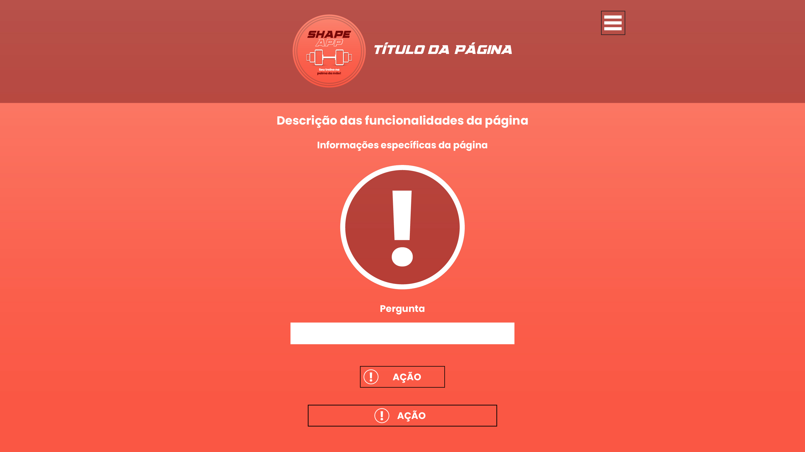

# Template Padrão da Aplicação

Através dos artefatos desenvolvidos na etapa de <a href="04-Projeto de Interface.md">Projeto de Interface</a> foram criadas 3 categorias de templates para o desenvolvimento da inteface da aplicação. São elas **Cadastro**, **Conteúdo** e **Criação de Treino**.

Para representar de forma genérica a iconografia utilizada, os ícones de uso específico do contexto do elemento foram substituídos por uma exclamação **"!"** conforme ilustrado abaixo.

</img>

## Template de Cadastro

O template de **cadastro** contempla as telas de criação e gerenciamento de perfil do usuário. São telas que dependem de inserção de dados e de realização de ações por meio de botões.

</img>

Layout do template de **Cadastro** versão mobile.

</img>

Layout do template de **Cadastro** versão desktop.

## Template de Conteúdo

O template de **conteúdo** contempla as telas de informações, ações, consultas, edições, navegação, seleção e atualização do que se refere ao conteúdo em si.

A ideia desse template é a utilização dos elementos de forma **modular**, à maneira que a utilização de todos os elementos não é obrigatória para uma mesma página, podendo selecionar aqueles que representaram o conteúdo da forma mais objetiva e assertiva.

</img>

Layout do template de **Conteúdo** versão mobile.

</img>

Layout do template de **Conteúdo** versão desktop.

## Template de Criação de Treino

O template de **criação de treino** contempla as telas responsáveis pela criação do principal elemento do aplicativo, que são os treinos sugeridos com base em perguntas ao usuário.

Trata-se também de uma tela de conteúdo, mas pela necessidade de um layout diferenciado para essa sessão, a fim de tornar a experiência do usuário mais rica em termos de usabilidade, foi desenvolvido este template exclusivo.

</img>

Layout do template de **Criação de Treino** versão mobile.

</img>

Layout do template de **Criação de Treino** versão desktop.
