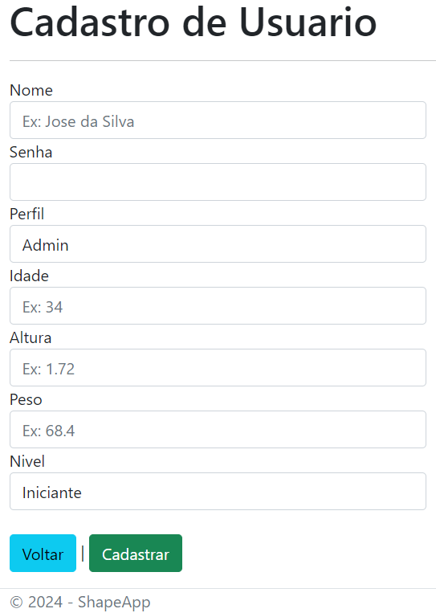
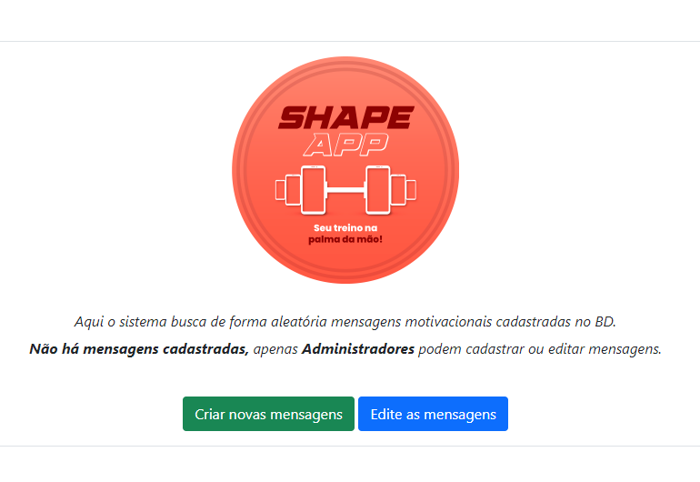

# Programação de Funcionalidades

## Detalhamento das funcionalidades desenvolvidas durante o microfundamento Desenvolvimento Web Backend (Entrega referente etapa 2):

### Aluna Isabella

Durante o microfundamento de foi desenvolvida uma aplicação web para gerenciar o consumo de veículos utilizando o Framework ASP.NET Core MVC.

Foram criadas as três camadas do padrão MVC (Model, View e Controller). Foram criadas as classes (veículo, consumo e usuário) e a configuração das operações de CRUD (Create, Read, Update, Delete) para o modelo das classes. Também foram desenvolvidas configurações de criptografia das senhas, autenticação e autorização das páginas.

É possível visualizar o funcionamento da aplicação no vídeo abaixo.

https://github.com/ICEI-PUC-Minas-PMV-SInt/pmv-sint-2024-1-e3-proj-back-t1-time-2/assets/137354714/eb57228f-40cf-40ee-b313-83da4fb80134

### Aluna Elisabete

Acompanhando o microfundamento, o desenvolvimento da aplicação Web, Veículos, utilizando ASP.NET.Core MVC ocorreu Erro de compilação na criação da camada View, mas depois foi encontrado um Erro de Sintaxe, que sendo corrigido, permitiu a criação da View. O restante das operções e configurações ocorreram conforme o professor Kleber ensinou.

## Detalhamento das funcionalidades focadas em back-end desenvolvidas durante a Etapa 3 do Projeto - Páginas desenvolvidas por cada integrante

## Instruções para criação do primeiro usuário para uso

Para que seja possível visualizar as funcionalidades do sistema, é necessário estar logado, seja como Admin ou User padrão.

Entretanto, apenas usuários Admin podem criar novos usuários. Para resolver tal paradoxo, foi habilitada a seguinte rota para criação de usuários iniciais de forma anônima:

_/Usuarios/Create_

### Aluno Danilo

Foi responsável pelo desenvolvimento da página inicial. Nesta página, além de conter o logo criado para a aplicação, de forma a apresenta-la ao usuário, existe uma funcionalidade de exibição de mensagens motivacionais referentes a persistência na academia.

Estas mensagens são resgatadas de forma aleatória no banco de dados da aplicação e exibidas para todos os tipos de perfil de usuário e também para usuários não logados (anônimos).

Usuários Administradores tem acesso a 2 botões logo abaixo das mensagens, 1 para criar novas mensagens e outro para editar mensagens existentes.

Caso não haja nenhuma mensagem cadastrada, o sistema mostra uma mensagem explicativa sobre o funcionamento neste espaço.

_Visualização User padrão ou usuário anônimo_

_Visualização Admin sem mensagens cadastradas_

Ao clicar no botão "Edite as Mensagens" o usuário Administrador pode verificar uma lista com as mensagens cadastradas, podendo visualiza-las, edita-las ou excluí-las do banco de dados.

### Aluna Isabella

Responsável pelo desenvolvimento das páginas **Exercícios** e **Meus treinos**. 

 - **Página Exercícios**: Somente o administrador tem acesso à essa página. Nela ele pode adicionar exercícios que serão incluídos de forma aleatória nos treinos dos usuários. Também é possível visualizar os exercícios já existentes, editá-los ou excluí-los. Apresenta CRUD completo (adicionar, visualizar, editar e apagar).
  
  

   

  

  

  

 - **Página Meus Treinos**: Nessa página o usuário pode criar o seu treino. No CRUD da página, além das funções adicionar, editar e excluir, existe um botão visualizar execícios, ao clicar nele o usuário é direcionado para uma página que contém uma lista de exercícios (que foram adicionados de forma aleatória), nessa página ele pode adicionar novos exercícios ou excluir os que ele desejar. Ao clicar em adicionar exercícios, uma lista de exercícios é aberta, para adicionar basta clicar no botão adicionar localizado na frente de cada exercício.

 

### Aluna Elisabete

Responsável pela Tela de Login. Usuários comuns e administradores são autenticados para acessar as páginas. porém somente usuários Admin tem acesso à todas as páginas incluindo Usuário e Exercícios. No Crud Usuários tem os botões Editar, Visualizar e Apagar com suas funcionalidades.

### Aluna Alicia

Foi responsável pelo desenvolvimento da página de CRUD de usuários e atualização perfil.

Apenas os usuários Admin tem acesso ao CRUD de usuários, sendo possivel criar um novo, visualizá-los, atualizar e remover.

Apenas usuários logados tem acesso a atualização de perfil.

- Tela 1 - Criação de usuários

- Tela 2 - Visualização de usuários

- Tela 3 - Detalhes do usuário

- Tela 4 - Atualização de usuários

- Tela 5 - Remoção de usuários

- Tela 6 - Atualização de perfil

## Aplicação dos Padrões de Projeto

A aplicação ShapeApp utiliza o padrão de desenvolvimento MVC, que por si só aplica em sua lógica de funcionalidades padrões Grasp.

Analisando a distribuição de responsabilidades entre as classes, podemos observar que o padrão **Criador** é aplicado sempre que um novo cadastro no banco de dados é efetuado através das telas de CRUD do sistema. Isso porque é através das telas existentes nas **Views** que o usuário pode interagir, mas é nas classes **Controladoras** que a ação é de fato efetivada, pois é nelas que já se contém **as informações necessárias para a ação**, que foram resgatadas do banco de dados por meio das classes de **Models**.

Ainda citando o exemplo do funcionamento do MVC, podemos relacionar ao padrão Grasp **High Cohesion** ou _Alta Coesão_. Isso porque as responsabilidades de cada classe são bem definidas. Além da separação entre camadas de modelo, visualização e controladores, dentro de cada uma destas pastas, as classes existentes ficam responsáveis por apenas 1 única responsabilidade da aplicação. Por exemplo, no caso do ShapeApp, a classe controladora _"UsuáriosController.cs"_ é responsável apenas pelo gerenciamento de usuários, não tendo outras responsabilidades, inclusive as funcionalidades de **Perfil** tem sua própria classe controladora.

 
 

 
 

Além dos padrões Grasp citados acima, toda a programação do código fonte segue o padrão de identação praticado no mercado conforme o exemplo abaixo:
 
 

