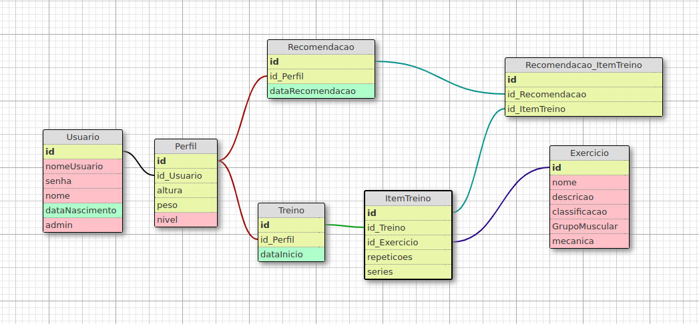
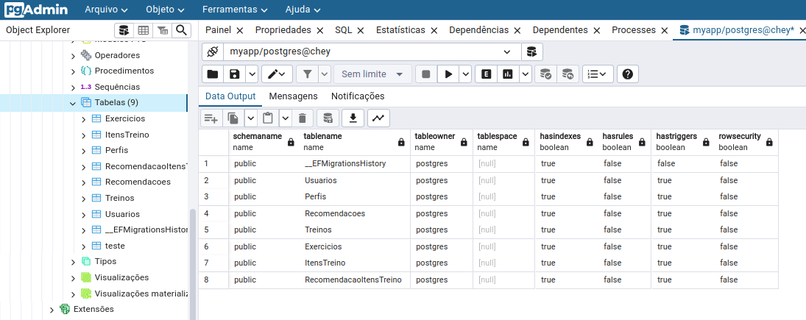
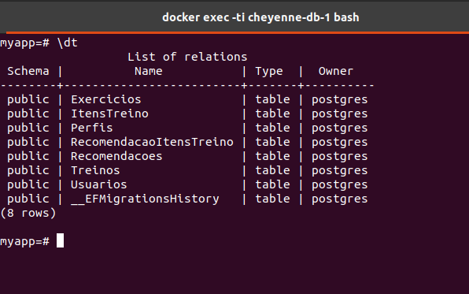

# Configuração do Banco de Dados para o ShapeApp

## Estudos e Simplificação do Modelo
Nos meus estudos, avaliei o modelo relacional existente e percebi oportunidades para otimização. Eliminei a tabela 'Pessoa' para reduzir a complexidade e inseri o atributo 'admin' na tabela 'Usuario', que por padrão é falso, para facilitar a distinção entre usuários comuns e administradores. Este ajuste ainda será submetido a testes para confirmar sua eficácia no controle de acessos.

## Técnica e Prática
Configurei o ASP.NET Core para o backend e utilizei contêineres para isolar a aplicação, o banco de dados PostgreSQL e o pgAdmin. A migração dos modelos atualizados para o banco de dados foi concluída com sucesso.

## Resultados
As tabelas seguintes foram criadas:
- `Usuarios`: Com 'admin' para controle de acesso.
- `Perfis`: Dados do perfil do usuário.
- `Treinos`, `Exercicios`, `ItensTreino`: Relacionam os treinos e exercícios.
- `Recomendacoes` e `RecomendacaoItensTreino`: Para personalização do treino.

## Capturas de Tela
As imagens abaixo validam as tabelas criadas:

  
   <i>Figura 1: Modelo Relacional Sugerido.</i>

  
   <i>Figura 2: Tabelas no pgAdmin.</i>

  
   <i>Figura 3: Tabelas no Container PostgreSQL.</i>

