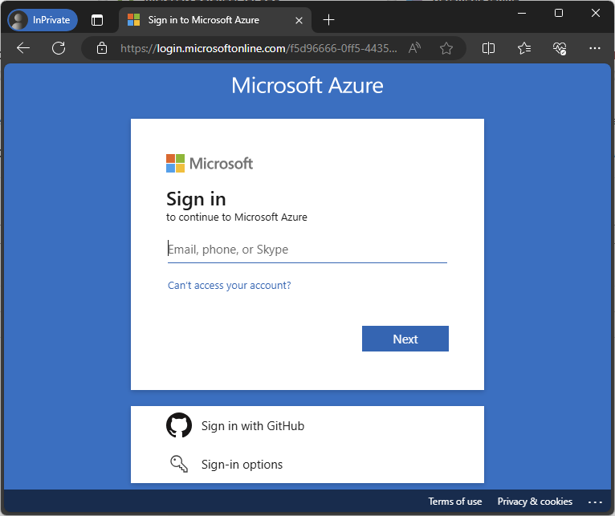
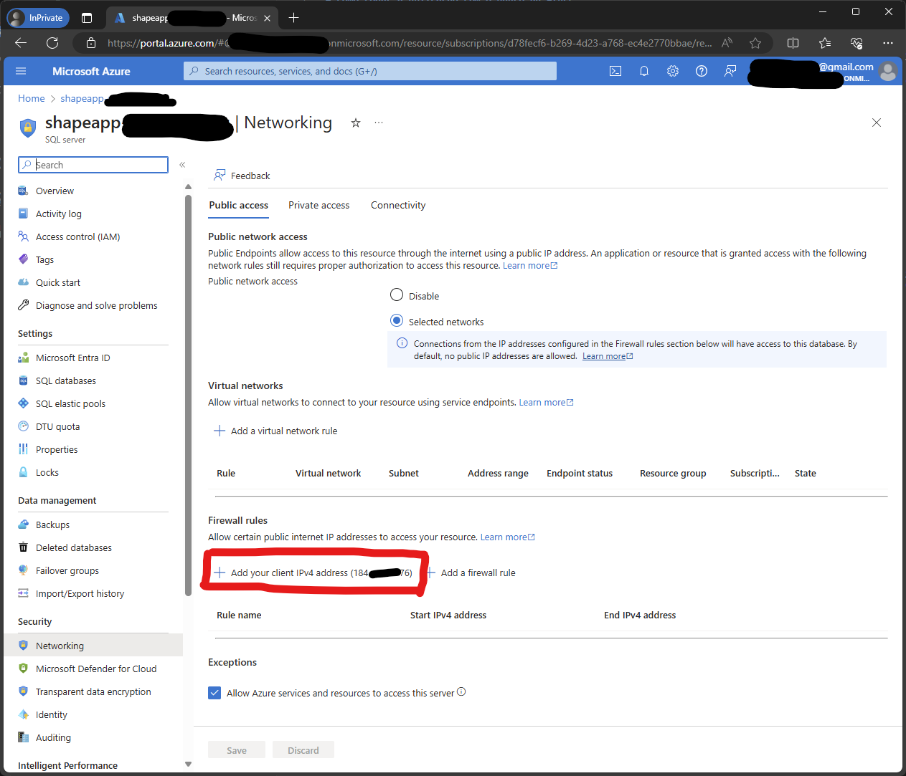

# Como rodar a aplicação com o banco na Azure

## Atualizar Firewall na Azure

1. Entrar na URL: https://portal.azure.com/#@f5d96666-0ff5-4435-8efe-5c4291d2e602/resource/subscriptions/d78fecf6-b269-4d23-a768-ec4e2770bbae/resourceGroups/databases/providers/Microsoft.Sql/servers/shapeapp-padgh195hfg/networking

2. Entrar com o email de convidado. Um código de autenticação é enviado para o email. Observação: Este é um login de convidado e a única forma de entrar é via código de autorização por email, portanto, não existe uma senha definida.


   
3. Adicionar o seu IP na regra do firewall
   



## Atualizar connection string

Para rodar a aplicação utilizando o banco na Azure basta registrar a connection string no dotnet secrets:

```
cd pmv-sint-2024-1-e3-proj-back-t1-time-2/src/ShapeApp/ShapeApp

dotnet user-secrets set "ConnectionStrings:DefaultConnection" "Server=address,1433;Initial Catalog=shapeapp;Persist Security Info=False;User ID=adm;Password=password;MultipleActiveResultSets=False;Encrypt=True;TrustServerCertificate=False;Connection Timeout=30;"
```
